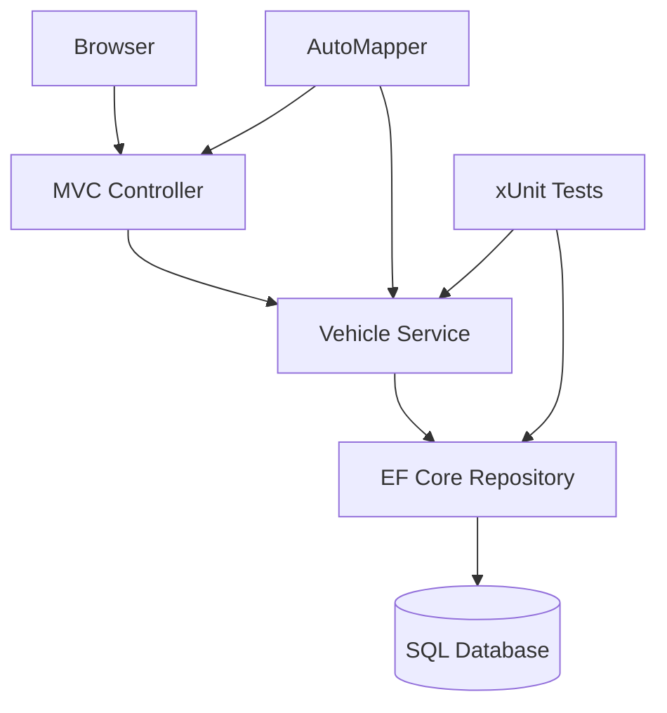

```markdown
# Vehicle Management System 🚗

[](https://github.com/1244Matt1244/vehicle_management_app/actions)
[](https://github.com/1244Matt1244/vehicle_management_app)
[](LICENSE)

**Modern vehicle inventory system** with robust CRUD operations and enterprise-ready architecture.

```diff
+ Production Ready | Clean Architecture | CI/CD Enabled | 85% Test Coverage
```

## 🌟 Features
- **Full Vehicle Management** - CRUD for makes/models
- **Advanced Filtering** - Pagination & sorting
- **Layered Architecture** - MVC ↔ Service ↔ Data
- **Automated Testing** - xUnit + Moq
- **CI/CD Pipeline** - GitHub Actions
- **HTTPS Security** - Dev certificate configured

## 🛠 Tech Stack
**.NET 8 Ecosystem**
- ASP.NET Core MVC
- Entity Framework Core
- AutoMapper
- xUnit + Moq
- SQL Server

**DevOps**
- GitHub Actions
- Docker Support
- EF Core Migrations

## 🚀 Getting Started

### Prerequisites
- .NET 8 SDK
- SQL Server (LocalDB included)
- VS Code/Rider/Visual Studio

```bash
# Clone & Trust Certificate
git clone https://github.com/1244Matt1244/vehicle_management_app.git
cd vehicle_management_app
dotnet dev-certs https --trust

# Restore & Run
dotnet restore
dotnet run --project Project.MVC
```

Access: https://localhost:5001

## 🧪 Testing
```bash
# Run Unit Tests
dotnet test

# Generate Coverage Report (requires reportgenerator)
dotnet test --collect:"XPlat Code Coverage"
reportgenerator -reports:./**/coverage.cobertura.xml -targetdir:./CoverageReport
```

## 📈 Architecture


## ☁️ Deployment Options

### Docker Development
```bash
docker-compose -f docker-compose.dev.yml up --build
```

### Azure App Service
```bash
az webapp up --name vehicle-mgmt --resource-group VehicleGroup --runtime "DOTNET:8.0"
```

## 🔧 Roadmap
```diff
+ Q3 2024 Priorities
- [x] Core CRUD Functionality
- [x] Pagination/Sorting
- [ ] Azure AD Integration
- [ ] Docker Production Setup
- [ ] Performance Benchmarking

+ Quality Improvements
! 95% Test Coverage Goal
! API Versioning
! Global Error Handling
```

## 🤝 Contributing
1. Fork repository
2. Create feature branch (`git checkout -b feature/AmazingFeature`)
3. Submit PR with:
   - Passing tests
   - Updated documentation
   - Clean commit history

---

**Production Guidelines**  
[](SECURITY.md)
[](STYLEGUIDE.md)

**[📘 Documentation](docs/README.md) | [📊 Project Board](https://github.com/users/1244Matt1244/projects/1) | [🐛 Issue Tracker](https://github.com/1244Matt1244/vehicle_management_app/issues)**
```