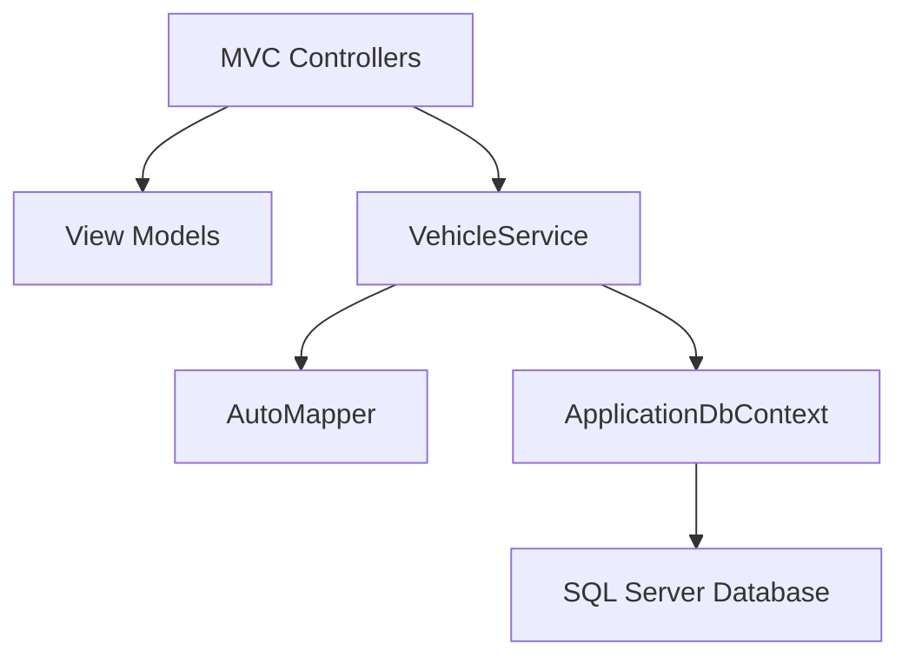

```markdown
# Vehicle Management System 🚗

[](https://github.com/1244Matt1244/vehicle_management_app/actions)
[](LICENSE)

**Modern Vehicle Inventory System**  
A robust, enterprise-ready application built on the .NET 9 ecosystem. It implements a clean, layered architecture to separate concerns between the MVC presentation layer, Service business logic, and Data access layer.

---

## Table of Contents

- [Overview](#overview)
- [Architecture](#architecture)
- [Features](#features)
- [Tech Stack](#tech-stack)
- [Getting Started](#getting-started)
- [Testing](#testing)
- [Deployment](#deployment)
- [Roadmap](#roadmap)
- [Contributing](#contributing)
- [License](#license)
- [Documentation](#documentation)

---

## Overview

The Vehicle Management System enables complete CRUD operations for vehicle makes and models. With advanced filtering, sorting, pagination, and robust error handling, this project is built with maintainability and scalability in mind. It leverages a layered approach to ensure that each part of the application is focused on its own responsibilities.

---

## Architecture

The application follows a classic layered architecture:

- **MVC (Presentation Layer):**  
  Handles HTTP requests, user interface, and client interactions. Controllers interact with view models and send responses.
  
- **Service (Business Logic Layer):**  
  Contains business logic and orchestrates data flows between the MVC layer and the Data access layer. It also uses AutoMapper for DTO conversion.
  
- **Data (Persistence Layer):**  
  Uses Entity Framework Core to interact with a SQL Server database. The data access layer encapsulates all CRUD operations.

Below is a Mermaid diagram that illustrates the flow between these layers:



### Explanation:
- **MVC Controllers (A):**  
  Receive incoming HTTP requests and pass data to view models (B) and services (C).
- **View Models (B):**  
  Represent the data structure used by the views.
- **VehicleService (C):**  
  Implements business logic, mapping DTOs via AutoMapper (D) and interacting with the database via ApplicationDbContext (E).
- **ApplicationDbContext (E):**  
  Provides an abstraction over the SQL Server Database (F) using Entity Framework Core.

---

## Features

- **Complete Vehicle Management:**  
  Full CRUD operations for both vehicle makes and models.
- **Advanced Filtering & Sorting:**  
  Seamless pagination, sorting, and filtering capabilities.
- **Clean Layered Architecture:**  
  Decoupled layers (MVC ↔ Service ↔ Data) promote maintainability and scalability.
- **Global Error Handling:**  
  Custom middleware handles exceptions and returns structured JSON error responses.
- **CI/CD Integration:**  
  GitHub Actions automate builds, tests, and deployments.
- **Docker Support:**  
  Containerized deployments for consistent production environments.
- **HTTPS Security:**  
  Enforced HTTPS with development certificates for secure communications.

---

## Tech Stack

**.NET 9 Ecosystem:**
- ASP.NET Core MVC
- Entity Framework Core 9
- AutoMapper

**Testing:**
- xUnit
- Moq

**Database:**
- SQL Server (LocalDB)

**DevOps:**
- GitHub Actions
- Docker

---

## Getting Started

### Prerequisites
- [.NET 9 SDK](https://dotnet.microsoft.com/download/dotnet/9.0)
- SQL Server (LocalDB is included)
- IDE: Visual Studio, VS Code, or Rider

### Setup Instructions

1. **Clone the Repository:**
   ```bash
   git clone https://github.com/1244Matt1244/vehicle_management_app.git
   cd vehicle_management_app
   ```

2. **Trust the Development Certificate:**
   ```bash
   dotnet dev-certs https --trust
   ```

3. **Restore and Build:**
   ```bash
   dotnet restore
   dotnet build
   ```

4. **Run the Application:**
   ```bash
   dotnet run --project Project.MVC
   ```
5. **Access the Application:**
   - Navigate to [https://localhost:7266](https://localhost:7266) in your browser.

---

## Testing

Automated tests are implemented using xUnit and Moq. To run the tests, use the following command:

```bash
dotnet test
```

Test results and coverage are displayed in the terminal, ensuring quality and reliability.

---

## Deployment

### Docker Deployment

Build the Docker image:

```bash
docker build -t vehicle-mgmt -f Project.MVC/Dockerfile .
```

Run the container:

```bash
docker run -p 8080:80 vehicle-mgmt
```

Your application will be accessible at [http://localhost:8080](http://localhost:8080).

---

## Roadmap

### 2025 Priorities
- [x] Core CRUD Functionality for Vehicle Makes/Models
- [x] Advanced Filtering & Sorting with Pagination
- [ ] Azure AD Integration for Enhanced Security
- [ ] Performance Benchmarking and Optimization

### Quality Goals
- **High Test Coverage:** Aim for robust automated tests.
- **Global Error Handling:** Refine exception middleware for clearer error reporting.
- **Clean Architecture:** Continuous improvement in layer decoupling.

---

## Contributing

Contributions are welcome! Please follow these steps:

1. **Fork the Repository**
2. **Create a Feature Branch:**
   ```bash
   git checkout -b feature/AmazingFeature
   ```
3. **Implement Your Changes:**  
   Ensure all tests pass.
4. **Submit a Pull Request:**  
   Provide detailed commit messages and update documentation as needed.

For ideas and open issues, check out our [Issue Tracker](https://github.com/1244Matt1244/vehicle_management_app/issues).

---

## License

This project is licensed under the [MIT License](LICENSE).

---

## Documentation

For more detailed documentation on API endpoints, design decisions, and setup instructions, please refer to our [docs/README.md](docs/README.md).

---

**Production Ready | Clean Architecture | CI/CD Enabled | Advanced Error Handling**
```
