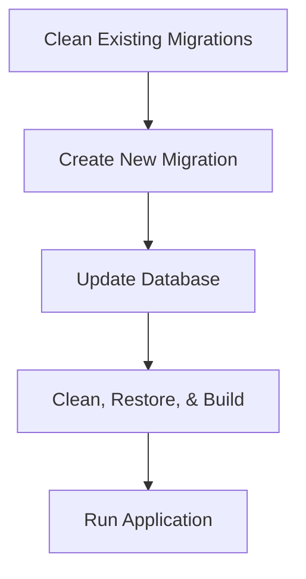

Below is the final, advanced README.md that captures all of your requirements, including a detailed architecture diagram, roadmap with checkboxes, database migration steps, build process, and deployment instructions. This version is tailored for a Visual Studio development environment and includes clear, actionable steps.

```markdown
# Vehicle Management System 🚗

[](https://github.com/1244Matt1244/vehicle_management_app/actions)
[](LICENSE)

**Modern Vehicle Inventory System** built on the .NET 9 ecosystem with a clean, layered architecture. This application provides complete CRUD operations for vehicle makes and models—with advanced filtering, sorting, and paging—all enforced using async/await, dependency injection via Ninject, and mapping via AutoMapper.

---

## Table of Contents

- [Overview](#overview)
- [Architecture & Workflow](#architecture--workflow)
- [Features](#features)
- [Requirements & Roadmap](#requirements--roadmap)
- [Database Migrations & Build Process](#database-migrations--build-process)
- [Getting Started](#getting-started)
- [Testing](#testing)
- [Deployment](#deployment)
- [Contributing](#contributing)
- [License](#license)
- [Documentation](#documentation)

---

## Overview

- **Project.MVC**: Presentation layer (controllers, views, and view models).
- **Project.Service**: Business logic layer with EF Core models, the `VehicleService` class (supporting sorting, filtering, and paging), and AutoMapper integration.
- **Project.Tests**: Automated tests using xUnit and Moq.

---

## Architecture & Workflow

The system is built using a layered architecture ensuring clear separation of concerns. The diagram below shows the complete flow—from development in Visual Studio to data management with SQL Server, managed via SSMS.

```mermaid
flowchart TD
    subgraph DEV[Development Environment]
        VS[Visual Studio]
    end

    subgraph MVC[Project.MVC (Presentation Layer)]
        Controllers[Controllers]
        Views[Views & ViewModels]
    end

    subgraph SERVICE[Project.Service (Business Logic Layer)]
        VehicleService[VehicleService]
        AutoMapper[AutoMapper]
    end

    subgraph DATA[Data Access Layer]
        EFCore[Entity Framework Core]
        DbContext[ApplicationDbContext]
        SQLDB[SQL Server Database]
    end

    subgraph TOOLS[Database Tools]
        SSMS[SQL Server Management Studio]
    end

    VS -->|Develops & Edits Code| Controllers
    VS -->|Develops & Edits Code| VehicleService
    Controllers -->|Calls| VehicleService
    VehicleService -->|Maps DTOs| AutoMapper
    VehicleService -->|Queries/Updates| DbContext
    DbContext -->|Executes EF Core Commands| SQLDB
    SSMS --- SQLDB

    Controllers --- Views

    style VS fill:#f9f,stroke:#333,stroke-width:2px,stroke-dasharray: 5 5
    style SSMS fill:#bbf,stroke:#333,stroke-width:2px
```

### How It Works

- **Development in Visual Studio:**  
  Code is authored and maintained using Visual Studio.
- **MVC Layer:**  
  Controllers receive HTTP requests, interact with view models, and send proper HTTP status codes.
- **Service Layer:**  
  Implements business logic (CRUD, filtering, sorting, paging) and uses AutoMapper to convert EF Core entities to DTOs.
- **Data Access:**  
  ApplicationDbContext (via EF Core) handles database interactions with a SQL Server backend.
- **Database Management:**  
  SQL Server Management Studio (SSMS) is used to monitor and manage the database.

---

## Features

- **Complete Vehicle Management:**  
  CRUD operations for both vehicle makes and models.
- **Advanced Filtering & Sorting:**  
  Dynamic sorting, search, and pagination.
- **Layered Architecture:**  
  Strict separation between MVC, Service, and Data layers.
- **Asynchronous Programming:**  
  Async/await is enforced throughout.
- **Dependency Injection (DI):**  
  Ninject is used for IoC, ensuring classes are testable and loosely coupled.
- **Object Mapping:**  
  AutoMapper is used to map between EF Core models and view models/DTOs.
- **Global Exception Handling:**  
  Custom middleware handles errors and returns structured JSON responses.
- **CI/CD Integration:**  
  Automated builds and tests with GitHub Actions.
- **Docker Support:**  
  Containerized deployment for consistent environments.
- **HTTPS Security:**  
  Enforced HTTPS with development certificates.

---

## Requirements & Roadmap

### Requirements

- **Database:**  
  - **VehicleMake:** Columns: `Id`, `Name`, `Abrv` (e.g., BMW, Ford, Volkswagen)  
  - **VehicleModel:** Columns: `Id`, `MakeId`, `Name`, `Abrv` (e.g., 128, 325, X5 for BMW)
- **Solution Structure:**  
  - **Project.Service:** Contains EF models and `VehicleService` class for CRUD (including sorting, filtering, and paging).
  - **Project.MVC:** Provides administration views for makes and models with filtering by make.
- **Implementation:**  
  - Enforce async/await across all layers.
  - Abstract classes using interfaces for unit testing.
  - Use IoC/DI (via Ninject) with constructor injection.
  - Use AutoMapper for DTO mapping.
  - Use EF Core (Code First) for database access.
  - Return view models (not EF models) in MVC.
  - Return proper HTTP status codes.

### Roadmap

#### 2025 Priorities
- [x] Implement Core CRUD Functionality for Vehicle Makes/Models  
- [x] Enhance Pagination, Sorting & Filtering  
- [ ] Integrate additional security measures  
- [ ] Refine global error handling and logging  

#### Quality Goals
- **High Test Coverage:** Robust automated testing.
- **Global Error Handling:** Precise and structured exception reporting.
- **Clean Architecture:** Strict separation of concerns across layers.

---

## Database Migrations & Build Process

### Database Migrations

Clean existing migrations and create a new migration to fix foreign key conflicts:

```bash
# Clean existing migrations
rm -rf Project.Service/Migrations/

# Create and apply a new migration
dotnet ef migrations add FixForeignKeyConflict --project Project.Service --startup-project Project.MVC
dotnet ef database update --project Project.Service --startup-project Project.MVC --verbose
```

### Build Process

For a complete clean build and to run the application, use:

```bash
dotnet clean && dotnet restore && dotnet build
dotnet run --project Project.MVC
```

### Deployment Workflow Diagram



---

## Getting Started

### Prerequisites

- [.NET 9 SDK](https://dotnet.microsoft.com/download/dotnet/9.0)
- SQL Server (LocalDB is included)
- Visual Studio

### Setup Instructions

1. **Clone the Repository:**
   ```bash
   git clone --recurse-submodules https://github.com/1244Matt1244/vehicle_management_app.git
   cd vehicle_management_app
   ```
2. **Initialize Development Certificates:**
   ```bash
   dotnet dev-certs https --clean
   dotnet dev-certs https --trust -ep ${HOME}/.aspnet/https/VehicleManagement.pfx -p "SecurePassword123!"
   ```
3. **Configure Local Secrets:**
   ```bash
   dotnet user-secrets init --project Project.MVC
   dotnet user-secrets set "ConnectionStrings:DefaultConnection" "Server=(localdb)\\MSSQLLocalDB;Database=VehicleManagement;Trusted_Connection=True;"
   ```
4. **Restore Dependencies and Build:**
   ```bash
   dotnet restore
   dotnet build
   ```
5. **Run the Application:**
   ```bash
   dotnet run --project Project.MVC
   ```
6. **Access the Application:**
   - Open [https://localhost:7266](https://localhost:7266) in your browser.

---

## Testing

Automated tests are implemented using xUnit and Moq. To run the tests, execute:

```bash
dotnet test
```

Test results, coverage, and performance metrics will be displayed in the terminal.

---

## Deployment

### Docker Deployment

1. **Build the Docker Image:**
   ```bash
   docker build -t vehicle-mgmt -f Project.MVC/Dockerfile .
   ```
2. **Run the Docker Container:**
   ```bash
   docker run -p 8080:80 vehicle-mgmt
   ```
3. **Access the Application:**
   - Navigate to [http://localhost:8080](http://localhost:8080).

---

## Contributing

Contributions are welcome! Please follow these guidelines:

1. **Fork the Repository**
2. **Create a Feature Branch:**
   ```bash
   git checkout -b feature/YourFeature
   ```
3. **Implement Your Changes:**  
   Ensure that all tests pass.
4. **Submit a Pull Request:**  
   Provide detailed commit messages and update documentation as needed.

For open issues or feature requests, refer to our [Issue Tracker](https://github.com/1244Matt1244/vehicle_management_app/issues).

---

## License

This project is licensed under the [MIT License](LICENSE).

---

## Documentation

For detailed API documentation, design decisions, and additional setup instructions, please refer to our [docs/README.md](docs/README.md).

---

**Production Ready | Clean Architecture | CI/CD Enabled | Global Error Handling**
```

This README.md provides a detailed overview, architecture and workflow diagrams, roadmap, migration and build instructions, and all necessary steps for getting started and contributing—all while staying factual about what is implemented in your repository. Adjust any details (e.g., connection strings, certificate passwords) to match your environment.
