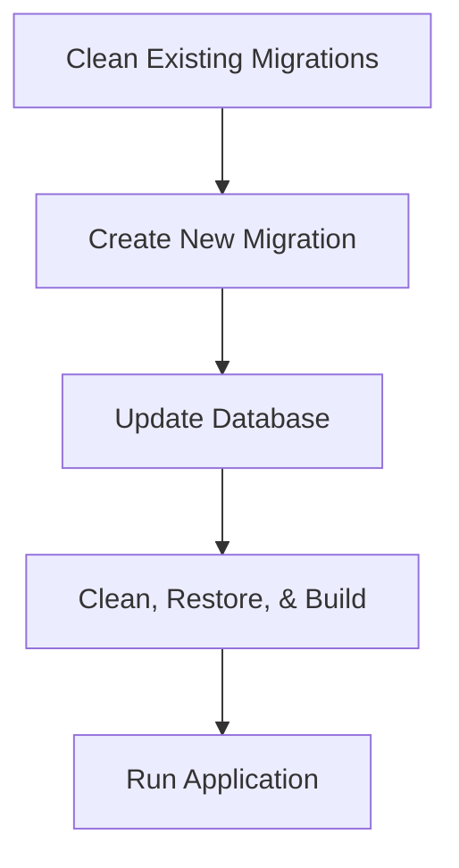

```markdown
# Vehicle Management System 🚗

[](https://github.com/1244Matt1244/vehicle_management_app/actions)
[](LICENSE)

**Modern Vehicle Inventory System** built on the .NET 9 ecosystem with a clean, layered architecture. This application provides complete CRUD operations for vehicle makes and models, with advanced filtering, sorting, and paging functionality—all enforced with async/await, dependency injection via Ninject, and mapping via AutoMapper.

---

## Table of Contents

- [Overview](#overview)
- [Architecture & Workflow](#architecture--workflow)
- [Features](#features)
- [Requirements & Roadmap](#requirements--roadmap)
- [Database Migrations & Build Process](#database-migrations--build-process)
- [Getting Started](#getting-started)
- [Testing](#testing)
- [Deployment](#deployment)
- [Contributing](#contributing)
- [License](#license)

---

## Overview

- **Project.MVC**: The presentation layer with controllers, views, and view models.
- **Project.Service**: The business logic layer with EF Core models, VehicleService class (with sorting, filtering, and paging), and AutoMapper integration.
- **Project.Tests**: Automated tests written using xUnit and Moq.

---

## Architecture & Workflow

The system is designed with a clear separation between the presentation (MVC), business logic (Service), and data access (EF Core) layers. The diagram below illustrates the flow from development in Visual Studio to database management via SSMS.

```mermaid
flowchart TD
    subgraph DEV[Development Environment]
        VS[Visual Studio]
    end

    subgraph MVC[Project.MVC (Presentation Layer)]
        Controllers[Controllers]
        Views[Views & ViewModels]
    end

    subgraph SERVICE[Project.Service (Business Logic Layer)]
        VehicleService[VehicleService]
        AutoMapper[AutoMapper]
    end

    subgraph DATA[Data Access Layer]
        EFCore[Entity Framework Core]
        DbContext[ApplicationDbContext]
        SQLDB[SQL Server Database]
    end

    subgraph TOOLS[Database Tools]
        SSMS[SQL Server Management Studio]
    end

    VS -->|Develops & Edits Code| Controllers
    VS -->|Develops & Edits Code| VehicleService
    Controllers -->|Calls| VehicleService
    VehicleService -->|Maps DTOs| AutoMapper
    VehicleService -->|Queries/Updates| DbContext
    DbContext -->|Executes EF Core Commands| SQLDB
    SSMS --- SQLDB

    Controllers --- Views

    style VS fill:#f9f,stroke:#333,stroke-width:2px,stroke-dasharray: 5 5
    style SSMS fill:#bbf,stroke:#333,stroke-width:2px
```mermaid

---

## Features

- **Complete Vehicle Management:**  
  Full CRUD operations for vehicle makes and models.
- **Advanced Filtering & Sorting:**  
  Built-in pagination, dynamic sorting, and search functionality.
- **Layered Architecture:**  
  Separation of concerns between MVC, Service, and Data layers.
- **Asynchronous Programming:**  
  `async/await` is enforced across all layers.
- **Dependency Injection & IoC:**  
  Uses Ninject for DI to ensure testability and loose coupling.
- **Mapping:**  
  AutoMapper converts EF models to DTOs/view models.
- **Global Error Handling:**  
  Custom middleware returns structured JSON error responses.
- **CI/CD & Docker Support:**  
  Automated builds and containerized deployments.
- **HTTPS Security:**  
  Enforced HTTPS using development certificates.

---

## Requirements & Roadmap

### Database & Projects Setup

- **Database:**  
  - **VehicleMake:** `(Id, Name, Abrv)` – e.g., BMW, Ford, Volkswagen  
  - **VehicleModel:** `(Id, MakeId, Name, Abrv)` – e.g., 128, 325, X5 (BMW)
- **Solution Structure:**  
  - **Project.Service:** Contains EF models and `VehicleService` for CRUD (with sorting, filtering, and paging).  
  - **Project.MVC:** Provides administration views for makes/models with filtering by make.
  
### Implementation Details

- Enforce **async/await** across all layers.
- Abstract classes using **interfaces** for unit testing.
- Use **IoC/DI** via Ninject (constructor injection preferred).
- Use **AutoMapper** for object mapping.
- Use **EF Core (Code First)** for database access.
- Return view models (not EF models) in MVC.
- Return proper HTTP status codes.
- Maintain a dedicated GitHub repository for the project.

### Roadmap

#### 2025 Priorities
- [x] Implement Core CRUD Functionality for Vehicle Makes/Models
- [x] Enhance Pagination, Sorting & Filtering
- [ ] Integrate additional security measures
- [ ] Refine global error handling and logging

#### Quality Goals
- **High Test Coverage:** Robust automated testing.
- **Global Error Handling:** Precise and structured exception reporting.
- **Clean Architecture:** Strict separation of concerns across layers.

---

## Database Migrations & Build Process

Follow these steps to clean existing migrations, create a new migration, and update the database:

```bash
# Clean existing migrations
rm -rf Project.Service/Migrations/

# Create a new migration to fix foreign key conflicts
dotnet ef migrations add FixForeignKeyConflict --project Project.Service --startup-project Project.MVC

# Apply the new migration to the database
dotnet ef database update --project Project.Service --startup-project Project.MVC --verbose
```

Then, for a full clean, restore, build, and run:

```bash
dotnet clean && dotnet restore && dotnet build
dotnet run --project Project.MVC
```

### Deployment Workflow Diagram



---

## Getting Started

### Prerequisites

- [.NET 9 SDK](https://dotnet.microsoft.com/download/dotnet/9.0)
- SQL Server (LocalDB is included)
- Visual Studio

### Setup Instructions

1. **Clone the Repository:**
   ```bash
   git clone https://github.com/1244Matt1244/vehicle_management_app.git
   cd vehicle_management_app
   ```
2. **Trust the Development Certificate:**
   ```bash
   dotnet dev-certs https --trust
   ```
3. **Restore Dependencies and Build:**
   ```bash
   dotnet restore
   dotnet build
   ```
4. **Run the Application:**
   ```bash
   dotnet run --project Project.MVC
   ```
5. **Access the Application:**
   - Open [https://localhost:7266](https://localhost:7266) in your browser.

---

## Testing

Run automated tests with:

```bash
dotnet test
```

Test results, coverage, and performance metrics will be displayed in the terminal.

---

## Deployment

### Docker Deployment

1. **Build the Docker Image:**
   ```bash
   docker build -t vehicle-mgmt -f Project.MVC/Dockerfile .
   ```
2. **Run the Docker Container:**
   ```bash
   docker run -p 8080:80 vehicle-mgmt
   ```
3. **Access the Application:**
   - Visit [http://localhost:8080](http://localhost:8080).

---

## Contributing

Contributions are welcome! To contribute:

1. **Fork the Repository**
2. **Create a Feature Branch:**
   ```bash
   git checkout -b feature/YourFeature
   ```
3. **Implement Your Changes:**  
   Ensure all tests pass.
4. **Submit a Pull Request:**  
   Provide detailed commit messages and update documentation as needed.

For open issues or ideas, please see our [Issue Tracker](https://github.com/1244Matt1244/vehicle_management_app/issues).

---

## License

This project is licensed under the [MIT License](LICENSE).

---

## Documentation

For further details on API endpoints, design decisions, and more, refer to our [docs/README.md](docs/README.md).

---

**Production Ready | Clean Architecture | CI/CD Enabled | Global Error Handling**
```
