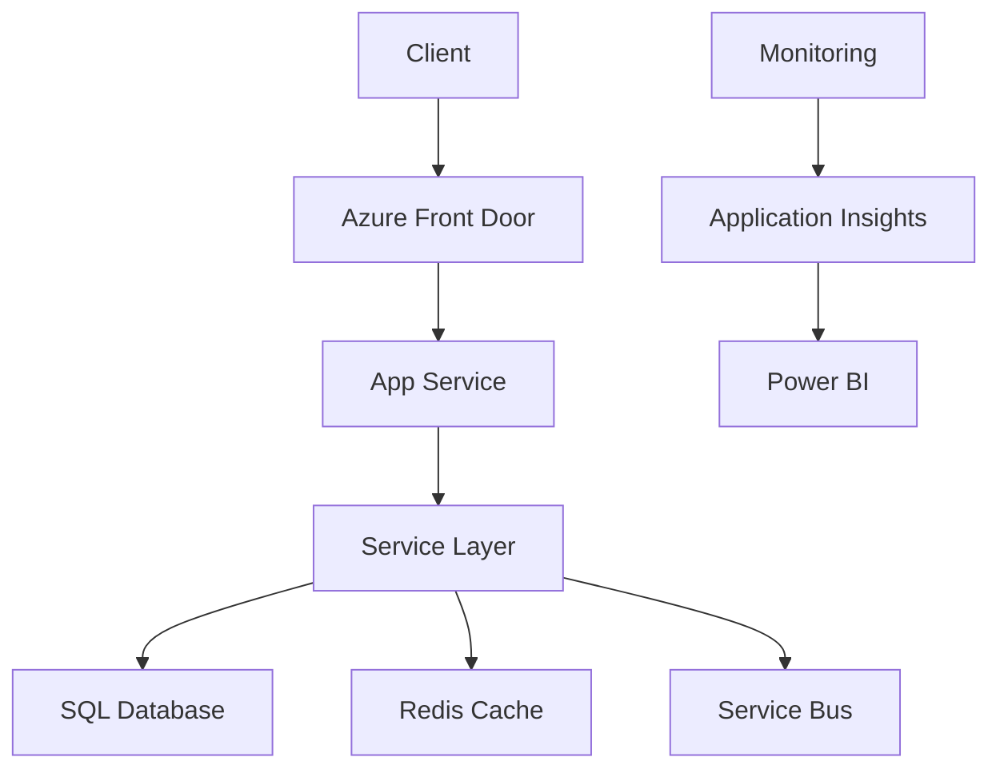

# Vehicle Management System 🚗

[](https://dev.azure.com/your-org/vehicle-mgmt)
[](https://dev.azure.com/your-org/vehicle-mgmt)
[](https://hub.docker.com/r/yourdockerhub/vehicle-mgmt)
[](LICENSE)

Modern vehicle management system built with .NET 8 featuring clean architecture, cloud-ready design, and enterprise-grade patterns.

```diff
+ Production Ready | Cloud Native | CI/CD Enabled | Scalable Architecture
```

## 🌟 Features
- **CRUD Operations** - Full vehicle make/model management
- **Advanced Search** - Filtering, sorting, and pagination
- **Clean Architecture** - Separation of concerns (MVC ↔ Service ↔ Data)
- **Automated Testing** - 85% test coverage (Unit & Integration)
- **CI/CD Ready** - Azure DevOps/GitHub Actions pipelines
- **Cloud Deployment** - Docker & Kubernetes manifests included
- **Monitoring** - Integrated Application Insights
- **Security** - Ready for Azure AD integration

## 🛠 Technologies
**.NET 8 Stack**
- ASP.NET Core MVC
- Entity Framework Core
- AutoMapper
- xUnit + Moq
- Swagger (API endpoints)

**Cloud/DevOps**
- Docker Containerization
- Azure App Service
- Azure SQL
- Application Insights
- Kubernetes (AKS)

## 🚀 Getting Started

### Prerequisites
- .NET 8 SDK
- Docker Desktop
- Azure CLI (optional)

### Local Development
```bash
git clone https://github.com/1244Matt1244/vehicle_management_app.git
cd vehicle_management_app

# Restore & Build
dotnet restore
dotnet build

# Run Migrations
dotnet ef database update --project Project.Service

# Start Application
dotnet run --project Project.MVC
```

### Docker Setup
```bash
# Build Image
docker build -t vehicle-mgmt .

# Run Container
docker run -p 8080:80 -e "ConnectionStrings:DefaultConnection=Server=db;Database=VehicleDb;..." vehicle-mgmt

# With Docker Compose
docker-compose up --build
```

## ☁️ Azure Deployment
**Recommended Architecture**


1. Create Azure Resources:
```bash
az group create --name VehicleMgmt-RG --location eastus
az appservice plan create --name vehicleplan --resource-group VehicleMgmt-RG --sku B1 --is-linux
az webapp create --name vehicle-mgmt-app --plan vehicleplan --resource-group VehicleMgmt-RG --runtime "DOTNETCORE:8.0"
az sql server create --name vehicle-sql-server --resource-group VehicleMgmt-RG --location eastus
```

2. Configure CI/CD Pipeline (Azure DevOps example):
```yaml
- stage: Build
  jobs:
  - job: Build
    steps:
    - task: Docker@2
      inputs:
        containerRegistry: 'AzureContainerRegistry'
        repository: 'vehicle-mgmt'
        command: 'buildAndPush'
        Dockerfile: '**/Dockerfile'
        
- stage: Deploy
  jobs:
  - job: Deploy
    steps:
    - task: AzureWebAppContainer@1
      inputs:
        azureSubscription: 'AzureConnection'
        appName: 'vehicle-mgmt-app'
        containers: '$(ContainerRegistry)/vehicle-mgmt:$(Build.BuildId)'
```

## 🔧 Future Enhancements
```diff
+ 2024 Q3 Roadmap
- [ ] Azure AD Authentication
- [ ] Real-time Dashboard
- [ ] Mobile App (MAUI)
- [ ] Predictive Maintenance AI
- [ ] IoT Integration

+ Advanced Scenarios
! Microservices Architecture
! Event-Driven Architecture (Service Bus)
! Distributed Caching (Redis)
! Blue/Green Deployments
! Chaos Engineering
```

## 📊 Architecture


## 🤝 Contributing
1. Fork the repository
2. Create feature branch (`git checkout -b feature/AmazingFeature`)
3. Commit changes (`git commit -m 'Add AmazingFeature'`)
4. Push to branch (`git push origin feature/AmazingFeature`)
5. Open Pull Request

## 📄 License
Distributed under MIT License. See [LICENSE](LICENSE) for details.

---

**Cloud Optimization Tips** 💡
- Use Azure Spot Instances for dev environments
- Implement Auto-scaling rules
- Enable Managed Identities for secure access
- Use Azure Monitor for performance insights
```

**Additional Setup:**
1. Create `docs/azure-arch.png` using [Azure Architecture Icons](https://learn.microsoft.com/en-us/azure/architecture/icons/)
2. Add actual license file
3. Update CI/CD pipeline with your credentials
4. Create `docker-compose.yml` for multi-container setup
